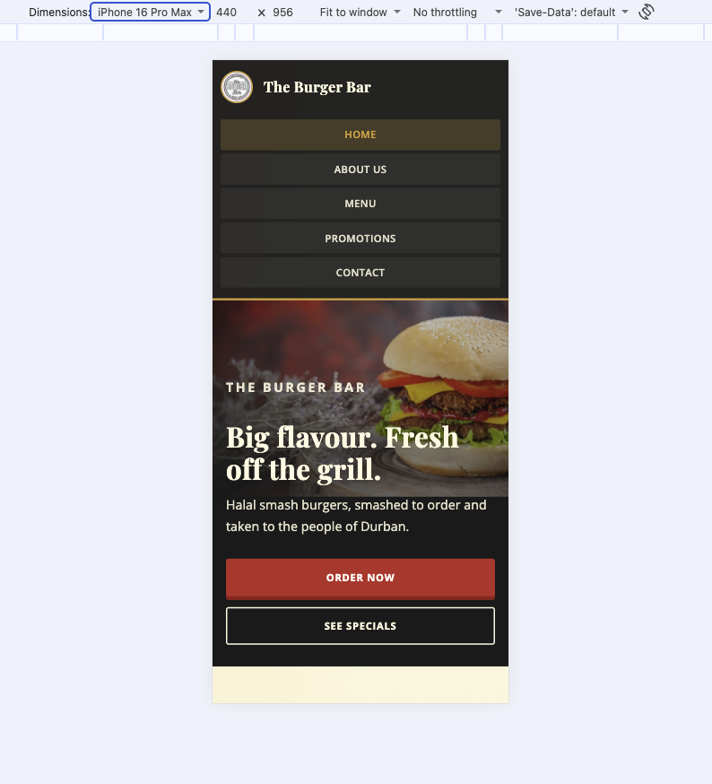
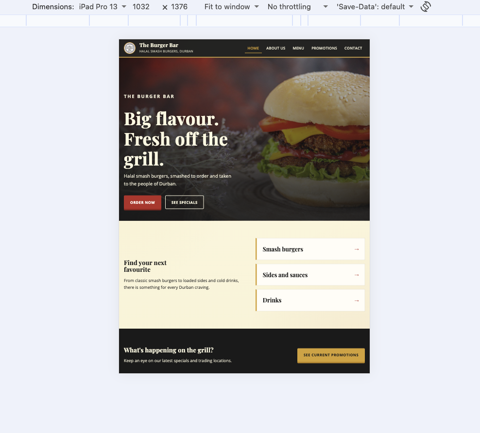
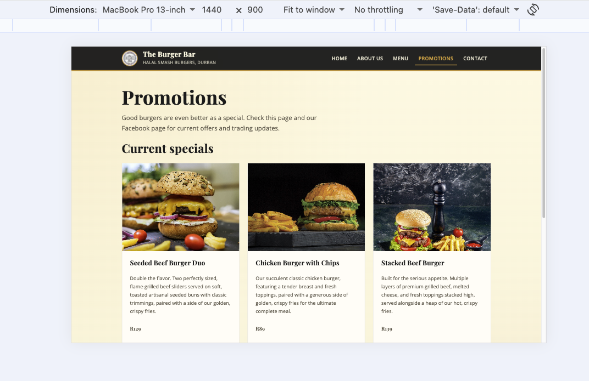

# The Burger Bar Website

## Student Information

- **Student:** Omar A. Lopes
- **Student number:** ST10546572
- **Module:** Introduction to Web Development
- **Module code:** WEDE5020w

## Project Overview

This project involves the development of a comprehensive website for The Burger Bar, a Durban-based mobile eatery specialising in American-inspired smash burgers. The website will serve as the digital presence for this local brand, which is halal and known for taking the grill to the people, including trading at 246 Currie Road in Morningside.

The Burger Bar website development project spans 12 weeks from 20 July 2026. This structured approach divides the work into three distinct phases, each building upon the previous foundation to create a comprehensive online presence for the business. Part 1 is due on 21 August 2026, Part 2 is due on 18 September 2026, and the Part 3 submission date is yet to be finalised.

The development of this website addresses the current lack of online presence for The Burger Bar. Through research conducted on the brand's Facebook page and related public listings on 20 July 2026, comprehensive insights were gathered regarding business operations, customer needs, and website requirements. This information serves as the foundation for creating a digital platform that accurately represents the brand's values and offerings.

The website showcases The Burger Bar's commitment to serving fresh, high-quality, American-inspired smash burgers that are halal, flavourful, and made to order, while bringing a fun, high-energy food experience to Durban and surrounding communities. 

## Website Goals and Objectives

### Primary Goals
 
The website has been designed to achieve several key business objectives:

**Menu Accessibility:** Customers can view the complete menu online, providing convenient access to all available burgers, sides, and drinks without needing to rely on Facebook posts or phone calls for information.

**Online Ordering Capability:** The platform enables customers to place orders directly through the website, streamlining the ordering process.

**Enhanced Visibility:** The website increases brand awareness and online presence beyond Facebook, making The Burger Bar more discoverable to potential customers in Durban and surrounding areas.

**Promotional Platform:** Special offers are prominently featured on a dedicated Promotions page to drive sales and customer engagement.

### Key Performance Indicators

The success of the website will be measured through several metrics:

- Monthly website traffic to gauge overall reach and engagement
- Number of online orders placed through the platform
- Click-through rates on promotional banners to assess marketing effectiveness
- Bounce rate analysis to evaluate user engagement and content relevance

## Target Audience

The website specifically caters to:

- Local families and individuals residing in Durban
- Students and young adults seeking convenient food options
- Smash-burger lovers across Durban
- Halaal diners looking for trusted preparation information

## Key Features and Functionality

### Essential Pages Structure

**Homepage (index.html):** Full-bleed hero with The Burger Bar branding, short brand introduction, calls to action for ordering and specials, category shortcuts into the menu, and footer contact information.

**About Us (about.html):** Brand history, mission and vision, halal preparation information, and Meet the team content for owners and staff with local images.

**Menu (menu.html):** Beef burgers, chicken burgers, combo, sides, and drinks organised in a responsive product grid with prices, quantity fields, and Add to cart forms linking to `order.html`.

**Promotions (promotions.html):** Current burger-and-chips specials with images, prices, Add to cart forms, and an Order now link.

**Contact (contact.html):** Location details for 246 Currie Road, Morningside, embedded Google Map, Apple Maps and Google Maps links, Facebook link, and a contact enquiry form.

**Order (order.html):** Customer details, menu selection, quantity, cart notes, and submit action for collection or delivery requests.

### Core Functionality

**Mobile Responsiveness:** CSS media queries, relative units (`rem`, `%`), and responsive images adapt the layout across desktop, tablet, and mobile breakpoints.

**Location Integration:** Embedded Google Map plus Open in Google Maps and Open in Apple Maps links.

**Communication Tools:** Contact form for enquiries and Facebook social link for trading updates.

**Ordering Path:** HTML-only Add to cart forms pass selected item, price, and quantity to `order.html` via the query string.

## Technical Implementation

The website uses HTML5 for semantic structure, an external CSS stylesheet for visual styling and responsive design, and a reserved JavaScript folder for Part 3 interactivity. Part 2 focuses on desktop styling, Flexbox/Grid layouts, typography, visual interaction states, and responsive behaviour.

Hosting is planned through Afrihost with the domain www.theburgerbardbn.co.za.

### Design system

| Token | Value | Use |
| --- | --- | --- |
| Ketchup Red | `#C62828` | Primary buttons, prices, active accents |
| Bun Cream | `#FFF8E1` | Page background |
| Mustard Gold | `#E09F3E` | Header accent line, secondary buttons, highlights |
| Charcoal Black | `#1A1A1A` | Header, footer, body text contrast |
| Playfair Display | Google Fonts | Headings |
| Open Sans | Google Fonts | Body text, navigation, forms |

### Responsive breakpoints

| Breakpoint | Approx. width | Layout behaviour |
| --- | --- | --- |
| Desktop | above `64rem` (~1024px) | Multi-column grids (3-up menu), horizontal sticky nav |
| Tablet | `40.01rem` to `64rem` (~641px–1024px) | Two-column product grids, stacked section layouts |
| Mobile | `40rem` and below (~640px) | Single-column content, compact 2-column nav grid |
| Small phones | `30rem` and below (~480px) | Single-column navigation |

## Content Strategy

All website content has been developed through primary research, including The Burger Bar's Facebook page and related public listings accessed on 20 July 2026. Visual elements use legally sourced stock photography from Magnific, professional typography from Google Fonts, and carefully selected colour schemes from ColorHunt that reflect a grilled smash-burger experience, featuring Ketchup Red (#C62828), Bun Cream (#FFF8E1), Mustard Gold (#E09F3E), and Charcoal Black (#1A1A1A).

## Development Timeline

### Part 1: Foundation (Weeks 1-5)

**Duration:** 20 July 2026 - 21 August 2026

HTML structure, researched content, navigation, images, forms, and README documentation.

### Part 2: CSS Styling and Responsive Design (Weeks 6-9)

**Duration:** 24 August 2026 - 18 September 2026

External stylesheet, CSS reset, typography scale, Flexbox/Grid desktop layouts, hover/focus/active states, media queries, relative units, responsive images (`srcset` / `picture`), screenshot evidence, and README updates.

### Part 3: Interactivity and SEO (Weeks 10-12)

**Duration:** 21 September 2026 - 05 October 2026

JavaScript interactivity, form behaviour, SEO improvements, and final testing.

## File and Folder Structure

```text
the-burger-bar/
├── index.html
├── about.html
├── menu.html
├── promotions.html
├── order.html
├── contact.html
├── css/
│   └── style.css
├── js/
├── images/
│   ├── responsive/          # 480w and 800w image variants for srcset
│   └── screenshots/         # Responsive testing evidence for Part 2
└── README.md
```

## Part 2 Details

Part 2 delivers the visual design and responsive behaviour for the website:

- External stylesheet `css/style.css` linked from every HTML page.
- CSS reset and shared base styles for fonts, colours, spacing, and links.
- Typography using Playfair Display (headings) and Open Sans (body), with a rem-based type scale.
- Desktop layouts built with Flexbox (header, hero actions, forms) and CSS Grid (menu products, about cards, team, contact/order split).
- Visual styling using the brand colour palette, borders, soft shadows on hover, and interactive `:hover`, `:focus`, and `:active` states on navigation, buttons, and form controls.
- Media queries for desktop, tablet, and mobile, switching multi-column layouts to single column on smaller screens.
- Relative units (`rem`, `%`) for typography, spacing, and fluid widths.
- Responsive images using `srcset`, `sizes`, and the `picture` element on key pages, with resized assets in `images/responsive/`.
- Browser developer tools and headless Chrome used to test and capture desktop, tablet, and mobile screenshots.

## Responsiveness Testing and Iteration Across Devices

These screenshots show how the site responds on common devices after iterative testing and adjustments.

### Mobile

**iPhone**



### Tablet

**iPad**



### Desktop

**MacBook Pro**



## Sitemap

```text
Home (index.html)
├── About Us (about.html)
├── Menu (menu.html)
│   ├── Burgers section
│   ├── Sides and sauces section
│   └── Drinks section
├── Promotions (promotions.html)
├── Order Online (order.html)
└── Contact (contact.html)
	├── Business address
	├── Google Maps embed and links
	├── Contact form
	└── Facebook link
```

## GitHub Repository

Commits should use descriptive messages, for example:

```text
Add Part 2 external stylesheet and link all pages
Implement responsive Grid and Flexbox layouts
Update README with Part 2 screenshots and changelog
```

## Detailed Changelog

### Part 1

**v1.0 - 19 Aug 2026:** Initial commit; created five HTML pages (`index.html`, `about.html`, `menu.html`, `promotions.html`, `contact.html`); added shared navigation and footer structures; added researched Burger Bar content; added menu categories for burgers, sides, sauces and drinks; added promotions and event information; added contact details, contact form and Google Maps link; added HTML comments explaining the main page sections; created the initial `README.md`.

**v1.1 - 19 Aug 2026:** Added the project overview, goals, target audience, features, technical details, timeline, changelog and references to the README; removed the email address from the README.

**v1.2 - 19 Aug 2026:** Removed the duplicate README title; removed the Pages heading; removed the Folders heading; removed the outdated HTML foundation text; removed the Navigation and Testing section.

**v1.3 - 19 Aug 2026:** Pushed all changes to the GitHub repository.

**v1.4 - 19 Aug 2026:** Added local images to the `images/` folder using kebab-case file names for the logo, hero image, owners, staff, beef burgers, chicken burgers, combo, sides, drinks and mocktails.

**v1.5 - 19 Aug 2026:** Updated `menu.html` with the full beef, chicken, combo, sides, and drinks and mocktails menu; added matching image tags, descriptions and South African Rand prices.

**v1.6 - 19 Aug 2026:** Updated `promotions.html` with three burger-and-chips specials, local images, combo prices, Add to cart forms and an Order now link to `order.html`.

**v1.7 - 19 Aug 2026:** Added an embedded Google Map on `contact.html` for 246 Currie Road, Morningside, Durban, plus Open in Google Maps and Open in Apple Maps links; added a Submit button after the message field.

**v1.8 - 19 Aug 2026:** Updated `index.html` with the local hero image, a homepage tagline and an Order now link to `menu.html`.

**v1.9 - 19 Aug 2026:** Updated `about.html` to match the About Us wireframe with business history, mission, vision, halal preparation and a Meet the team section for owners Amber Smith and Abel Khan and staff, including owner and staff images.

**v1.10 - 19 Aug 2026:** Created `order.html` with customer details, menu selection, quantity, cart notes and a Submit now button.

**v1.11 - 19 Aug 2026:** Added HTML-only Add to cart forms with quantity fields on all menu products and promotional food specials; added Order now links to `order.html` on `menu.html`.

**v1.12 - 19 Aug 2026:** Removed event catering, live-station booking and annual feeding-project content from `index.html`, `about.html`, `promotions.html` and `contact.html`.

### Part 1 feedback corrections (applied during Part 2)

**v1.13 - 18 Sep 2026:** Standardised the shared header across all pages so every page now includes the logo, brand name, and consistent Durban tagline (Part 1 pages previously used inconsistent header markup, with only the homepage carrying a tagline).

**v1.14 - 18 Sep 2026:** Added the logo image to the site header on every page to strengthen brand recognition and strengthen clear Burger Bar identity in the navigation area.

**v1.15 - 18 Sep 2026:** Wrapped page content in consistent layout containers (`site-wrap`, section classes) so structural markup is ready for cascading CSS without duplicating large amounts of inline or page-specific styling.

**v1.16 - 18 Sep 2026:** Improved semantic grouping on About, Menu, Promotions, Contact and Order pages (for example product card bodies, team cards, enquiry form and contact layout) so styles can cascade from a small set of reusable class selectors.

### Part 2

**v2.0 - 18 Sep 2026:** Created external stylesheet `css/style.css` and linked it from `index.html`, `about.html`, `menu.html`, `promotions.html`, `order.html` and `contact.html`.

**v2.1 - 18 Sep 2026:** Implemented a CSS reset and base styles covering box-sizing, default margins, image behaviour, form inheritance, body typography, and brand colour tokens as CSS custom properties.

**v2.2 - 18 Sep 2026:** Applied typography styles with Google Fonts (Playfair Display for headings, Open Sans for body), including font-size scale, font-weight, line-height and letter-spacing hierarchy from H1 through body and button text.

**v2.3 - 18 Sep 2026:** Built desktop layouts with Flexbox (sticky header, brand block, hero actions, product forms) and CSS Grid (menu product grids, about cards, team grid, contact/order two-column layouts, homepage category and promo sections).

**v2.4 - 18 Sep 2026:** Added visual styling for colours, backgrounds, borders and soft hover elevation; implemented interactive `:hover`, `:focus` and `:active` states on navigation links, primary/secondary buttons, category links and form fields.

**v2.5 - 18 Sep 2026:** Implemented responsive design with media-query breakpoints for desktop, tablet and mobile; switched three-column layouts to two columns on tablet and one column on phones; adjusted navigation, font sizes and spacing for smaller screens using `rem` and `%`.

**v2.6 - 18 Sep 2026:** Generated 480w and 800w image variants in `images/responsive/` and applied `srcset`/`sizes` (and `picture` on the homepage hero) so browsers can request appropriate image resolutions.

**v2.7 - 18 Sep 2026:** Tested layouts across devices and documented responsiveness evidence in the README under Responsiveness Testing and Iteration Across Devices, using device-frame screenshots for iPhone (mobile), iPad (tablet) and MacBook Pro (desktop) stored as `images/iphone-responsiveness.png`, `images/ipad-responsiveness.png` and `images/macbook-responsiveness.png`.

**v2.8 - 18 Sep 2026:** Updated this README with Part 2 details, design system, breakpoint table, expanded changelog and refreshed references.

**v2.9 - 18 Sep 2026:** Changed Add to cart behaviour so customers stay on `menu.html` or `promotions.html` while adding items; cart items are stored locally and a sticky cart bar shows item count with Keep browsing and Checkout actions. The full checkout form on `order.html` only appears after the customer chooses Checkout when they are done adding items.

**v2.10 - 18 Sep 2026:** Updated `order.html` into a checkout page that lists cart contents, lets customers continue shopping via Add more items, and only reveals customer details once the cart has items.

**v2.11 - 18 Sep 2026:** Added quantity controls on checkout (`−`, number field and `+`) so customers can increase or reduce quantities without removing a whole line; decreasing to zero removes that item. Remove and Clear cart remain available.

**v2.12 - 18 Sep 2026:** Added cart totals: each checkout line shows a subtotal, a Cart total block shows the full amount in Rand, and the sticky cart bar on menu/promotions also shows a running total while browsing.

**v2.13 - 18 Sep 2026:** Added `js/cart.js` and linked it from `menu.html`, `promotions.html` and `order.html` to power stay-on-page cart updates, checkout quantity editing and live total calculations.

## References

- The Burger Bar, 2026. Facebook page. Available at: https://www.facebook.com/theburgerbardbn (Accessed 20 July 2026).
- Afrihost, 2026. Domains. Available at: https://www.afrihost.com/domains (Accessed 20 July 2026).
- ColorHunt, n.d. Colour palettes for designers and artists. Available at: https://colorhunt.co (Accessed 20 July 2026).
- Google Fonts, n.d. Free fonts library. Available at: https://fonts.google.com (Accessed 20 July 2026).
- Magnific, n.d. Images. Available at: https://www.magnific.com (Accessed 20 July 2026).
- Mozilla Developer Network (MDN), n.d. Using media queries. Available at: https://developer.mozilla.org/en-US/docs/Web/CSS/CSS_media_queries/Using_media_queries (Accessed 18 September 2026).
- Mozilla Developer Network (MDN), n.d. Responsive images. Available at: https://developer.mozilla.org/en-US/docs/Learn/HTML/Multimedia_and_embedding/Responsive_images (Accessed 18 September 2026).
- Mozilla Developer Network (MDN), n.d. CSS Grid Layout. Available at: https://developer.mozilla.org/en-US/docs/Web/CSS/CSS_grid_layout (Accessed 18 September 2026).
- Mozilla Developer Network (MDN), n.d. Flexbox. Available at: https://developer.mozilla.org/en-US/docs/Learn/CSS/CSS_layout/Flexbox (Accessed 18 September 2026).
- W3C, n.d. Cascading Style Sheets. Available at: https://www.w3.org/Style/CSS/ (Accessed 18 September 2026).
